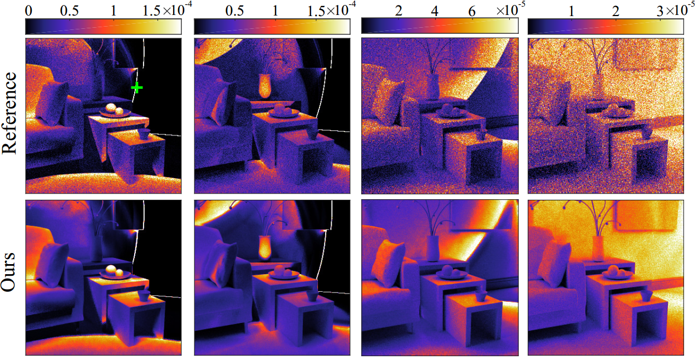

# Compression and Denoising of Transient Light Transport

## General Information
- Accepted: SIGGRAPH 2019 Posters; Optics Letters
- Writers: Yun Liang, Mingqin Chen, Zesheng Huang, Diego Gutierrez, Adolfo Muñoz, Julio Marco
- Institute: South China Agricultural University; Universidad de Zaragoza

For more information please see the paper:
- [[Optics Letter]](https://www.osapublishing.org/ol/abstract.cfm?uri=ol-45-7-1986)
- [[ACM SIGGRAPH 2019 Posters]](http://webdiis.unizar.es/~juliom/pubs/2019SIGPoster_compression_poster_abstract.pdf)
- [[Video]](http://webdiis.unizar.es/~juliom/pubs/2020OL-CompressionDenoisingTransient/2020OL_CompressionDenoisingTransient_Visualization_1.mp4)

## Requirements
* Python 3.6
* Tensorflow 1.12.0(https://www.tensorflow.org)
* numpy
* scipy
* h5py
All of them can be installed via `conda` (`anaconda`), e.g.
```
conda install scikit-image
```

## How to Execute Demo
We have written a demo code in `reconstruction.py`. In the main function of it, there called two different functions: 
* **demo_recon_video()** : this function demonstrates our reconstruction for the transient image "church_albedo_1_view_2.h5".
* **demo_recon_anydata()**: this function demonstrates our reconstruction for any data.

## How to Train the Network

* Set the value of N_FILE_SAMPE in `params.py`, which means how many sample(1 x 4096 x 9 x 9 x 1) in one file.
* Set the value of TRAININGSET_PATH in `params.py`, which means where the training files saved.
* run `ae_estimator.py` for training

#### In our case
* There are 145 transient images in training set and 37 transient images in test set.
* We sample 6000 patchs(1 x 4096 x 9 x 9 x 1) from each transient images, so there are 870000 samples
* We randomly save them in 40 ".h5" files, each files have 21750 samples and the shape of the dataset('/training_set') is "21750 x 4096 x 9 x 9 x 1". So we set the N_FILE_SAMPE 21750
* These files are saved in "F:/9x9_6000sample/", so we set TRAININGSET_PATH "F:/9x9_6000sample/" 

## Citation
```
@inproceedings{liang2019data,
  title={A data-driven compression method for transient rendering},
  author={Liang, Yun and Chen, Mingqin and Huang, Zesheng and Gutierrez, Diego and Mu{\~n}oz, Adolfo and Marco, Julio},
  booktitle={ACM SIGGRAPH 2019 Posters},
  pages={33},
  year={2019},
  organization={ACM}
}
@article{liang2020compression,
  title={Compression and Denoising of Transient Light Transport},
  author={Liang, Yun and Chen, Mingqin and Huang, Zesheng and Gutierrez, Diego and Mu{\~n}oz, Adolfo and Marco, Julio},
  journal={Optics Letters},
  year={2020},
}
```

## Contacts
For questions, please send an email to **csmingqinchen@mail.scut.edu.cn**